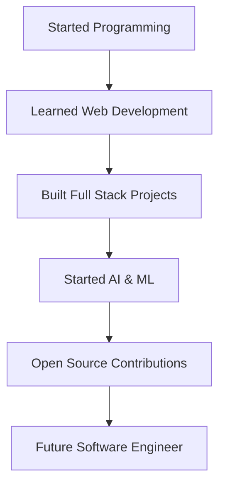

  

  <h1>👋 Hi, I'm Sudharshan</h1>
  
<strong>Computer Science Engineering Student | Full Stack Developer | Open Source Contributor</strong>

  

    
  
  
  

---

## 👨‍💻 Professional Summary
I am a Computer Science Engineering student passionate about Software Engineering, AI/ML, and Cybersecurity. I specialize in building scalable web applications and am currently diving deep into Cloud Computing. I thrive on solving real-world problems through code and am actively looking for internship opportunities to contribute and grow in a professional setting.

---

## ℹ️ Quick Info
| Category | Information |
| :--- | :--- |
| 🎓 **Education** | Computer Science Engineering Student |
| 🚀 **Role** | Full Stack Developer |
| 📍 **Location** | India |
| 🎯 **Interests** | AI/ML, Cybersecurity, Cloud Computing |
| 📚 **Learning** | React, Next.js, AI Agents, Cybersecurity |
| ✉️ **Contact** | [Email Me](mailto:your-email@example.com) |
| 🤝 **Open To** | Internships, Open Source, Hackathons |

---

## 🛠️ Tech Stack

  

---

## 🚀 Current Focus

  <table>
    <tr>
      <th>Currently Learning</th>
      <th>Currently Building</th>
    </tr>
    <tr>
      <td>React, Next.js, AI Agents</td>
      <td>Hostel Management System</td>
    </tr>
    <tr>
      <td>Cybersecurity, Cloud, Docker</td>
      <td>College & Portfolio Websites</td>
    </tr>
  </table>

---

## 📂 Featured Projects
*(Note: Please update links to your actual repository URLs)*
- **Hostel Management System:** Full-stack management platform for efficiency.
- **College Website:** Informational platform for educational institutions.
- **AI/ML Analysis Suite:** Data-driven insights using Scikit-learn.
- **Portfolio Website:** Professional showcase of my work.
- **CRUD Application:** Scalable data management interfaces.
- **Open Source Contributor:** Various contributions to community projects.

---

## 📈 GitHub Analytics

  
  
  

---

## 🐍 Contribution Snake

  

---

## ⏳ Developer Journey

---

## 🏆 Achievements & Certifications
- **Internships:** InternPe & Codeon Technologies
- **Goal:** Pursuing AWS, Azure, and Google Cloud Certifications

---

  
  
<i>"The best way to predict the future is to create it."</i>

  
Thanks for visiting! Let's build something amazing together. Happy Coding!

